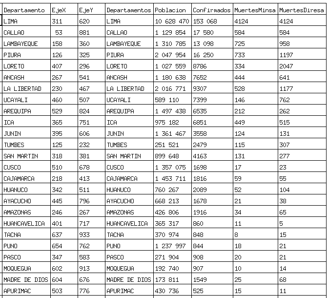
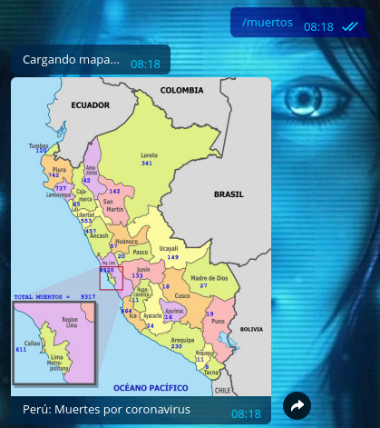
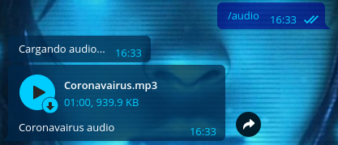

# Telegram Bot Covid  

## TelegramBot  
1. Para obtener la tabla con la data  
	1. Ejecutamos  
		```
		$ Rscript tabla.R
		```  
	2. Esto genera: csv/datos.csv  
		
2. Para obtener la imagen con los datos de personas fallecidas por coronavirus  
	1. Ejecutamos  
		```
		$ python2.7 mapa.py
		```
	2. Esto genera: img/PeruTemporal.png  
		
3. Para ejecutar el bot  
	1. Ejecutamos  
		```
		$ npm init
		$ npm install --save node-telegram-bot-api
		$ node index.js
		```
	2. Entonces ya podremos consultar al bot  
4. Para interacturar con el bot  
	1. Buscamos en Telegram el bot que ya he creado: covidPeru  
		
	2. Para consultarle la cantidad de muertos por coronavirus escribimos: /muertos  
		
	3. Para consultarle la cantidad de casos confirmados de coronavirus escribimos: /confirmados  
		
	4. Para consultarle la población de Perú escribimos: /poblacion  
		
	5. Audio: /audio  
		
	6. Video: /video  
		
## Coordenadas  
1. Si queremos reubicar los puntos donde se escribirán los números en la imagen  
	```
	$ python3.8 coordenadas.py
	```
	1. Una vez iniciado tenemos que escribir los departamentos del Perú, uno por uno  
		  
		
	2. En la imagen hacemos doble clic en la parte que corresponde al departamento del Perú que escribimos  
		
	3. Hacemos lo mismo para todos los departamentos del Perú  
	4. Para terminar nos ubicamos en la imagen y presionamos: ESC  
	5. Al final obtendremos el archivo con las nuevas coordenadas donde se ubicarán los valores: coordenadas.csv  
		
## Ejecutar el bot en una Raspberry Pi  

1. Ejecutamos   
	```
	$ sudo crontab -e
	```
2. Pego esto al final para que se ejecute el bot cuando la Raspberry Pi se prende  
	```
	@reboot /usr/bin/node /home/pi/app/TelegramBotCovid/TelegramBot/bot/index.js
	```
	
